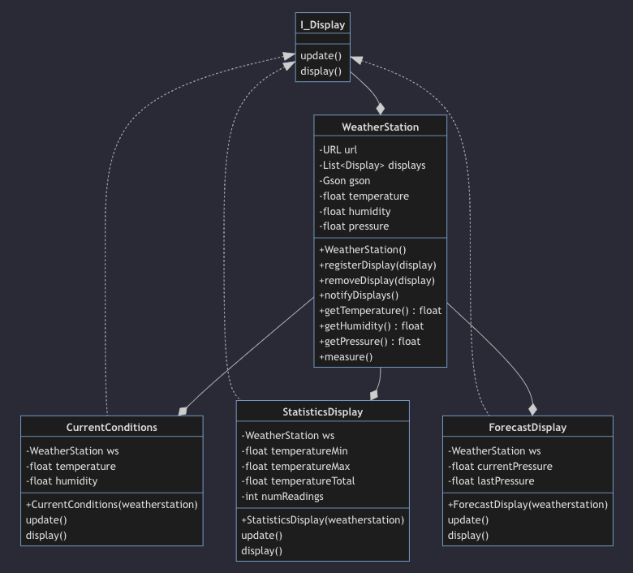

# Java-Lab-010

## INTRODUCTION!!!

First, let me define a new **TYPE** you have not yet seen in Java, the **interface**.

An **interface** in the Java programming language is an **abstract type** (meaning it has methods, but NO method implementations) that is used to declare a behavior (i.e. methods, which are verbs/actions) that classes **MUST implement**. They are similar to protocols. **Interfaces** are declared using the **interface keyword**, and only contain **method signatures** and **constant declarations**. To use an interface, a concrete class must first declare that it plans on **implementing** the interface, and then ACTUALLY implement the body of all the methods in the Interface.

For example consider the interface Canine:

```java
public interface Canine {
    public String sound();
    public void eat(Protien p);
    public void sleep(int hours, int minutes);
}
```

As you can see there are methods declared (method signatures), but no method **bodies**. Thus, there are behaviors, but how they are implemented is missing. Now consider the Dog and Wolf below:

```java
public class Dog implements Canine {
    @Override
    public String sound() {
        return "BARK";
    }

    @Override
    public void eat(Protien p) {
        System.out.printf("Yum yum %d ounces of %s%n", p.getAmount(), p.getType());
    }

    @Override
    public void sleep(int hours, int minutes) {
        System.out.printf("I slept for %d hours and %d minutes%n", hours, minutes);
    }
}

public class Wolf implements Canine {
    @Override
    public String sound() {
        return "HOWL!!!";
    }

    @Override
    public void eat(Protien p) {
        System.out.printf("Gnarl, growl %d ounces of %s%n", p.getAmount(), p.getType());
    }

    @Override
    public void sleep(int hours, int minutes) {
        System.out.printf("Wolf slept for %d hours and %d minutes%n", hours, minutes);
    }
}
```

...what may look new to you is **implements Canine**. This is how a **Concrete Class** informs the Java code parser, that it is choosing to **Implement** the **methods** (i.e. the behaviors) declared without method bodies in the **interface**. As you can see, both the Dog class and the Wolf class **implements Canine** meaning both classes **MUST** override and give method bodies, to **ALL** the method signatures in the **Canine interface**.

What may not be obvious is that even though Wolf and Dog implement the method signatures differently, because both Wolf and Dog contain the same behaviors/methods declared in Canine, both Wolf and Dog can ALSO be treated as if they are **Canine** objects. Thus, interfaces allow programmers to treat objects that do completely different things similarly because they share the same behaviors/methods. What does this mean? Consider the main program below:

```java
public class Main {
    public static void main(String[] args) {
        Canine[] canines = new Canine[2];
        canines[0] = new Dog();
        canines[1] = new Wolf();

        for(Canine c : canines) {
            System.out.printf("%s makes sound %s%n", c.getClass().getName(), c.sound());
        }
    }
}
```

```bash
# Output from main method above:
Dog makes sound BARK
Wolf makes sound HOWL!!!
```

...notice how both Wolf and Dog are assigned to a Canine array! Notice how we can loop over the array, treating both as **Canine** but when the c.getClass() method is called, the specific class type for Wolf or Dog is returned, and when c.sound() is called, the specific sound for Wolf or Dog is returned? This is the power Interfaces give us, and the technique is often referred to as polymorphism.

**You will be doing something similar in this lab!**

## Part 1 - What do I have to Work with?

* Trace through the code in WeatherStation and make sure you understand what you have to work with!
* Look at the Display.java **interface** and in your own words, write below why you think we are declaring an **interface**.

## Part 2 - Create 3 Classes that **Implement** Display.java



* UML is Unified Modeling Language and UML diagrams should directly translate into Java Class structures.

* Using the UML model and the following descriptions, make 3 different display classes.
    * Create a class **CurrentConditions.java** that **implements** Display.
        * It's **update method** should update its temperature, humidity, and pressure instance variables from its WeatherStation instance then call the **display()** method.
        * It's **display method** should simply print out in a well formatted message of this object's: Temperature, Humidity, and Pressure.
    * Create a class **StatisticsDisplay.java** that **implements** Display.
        * It's **update method** should update instance variables temperatureMin, temperatureMax, tempRunningTotal, and numReadings
        * It's **display method** should print out the **min, max, and average temperature values**.
    * Create a class **ForecastDisplay.java** that **implements** Display.
        * It's **update method** should keep track of the last and current pressure in instance variables lastPressure and currentPressure
        * It's **display method** should use the following algorithm to provide a forecast.
        ```
        System.out.print("Forecast: ");
        if (currentPressure > lastPressure) {
            System.out.println("Improving weather on the way!");
        } else if (currentPressure == lastPressure) {
            System.out.println("More of the same");
        } else if (currentPressure < lastPressure) {
            System.out.println("Watch out for cooler, rainy weather");
        }
        ```
      
## Part 3 - Turn-In - Same Process as Prior Weeks!

* Commit your code
* Push back to your Fork
* Create a Pull Request back to my Repo
* Finish the lab by pasting your pull request URL into the Lab assignment.

